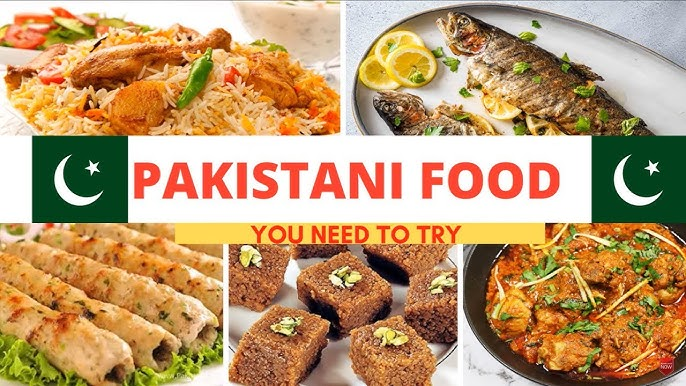

# **Pakistani Cuisine**  

Pakistani cuisine is a blend of rich and diverse flavors, influenced by regional traditions and neighboring countries such as India, Afghanistan, and Iran. It is known for its use of spices, herbs, and bold flavors. Here’s an overview of its unique culinary delights.

---

## **1. Popular Dishes**

### **a. Biryani**

Biryani is a flavorful rice dish made with basmati rice, spices, and meat such as chicken, mutton, or beef. It is a staple in celebrations and gatherings.

### **b. Nihari**

Nihari is a slow-cooked stew made with meat (often beef or lamb) and a rich, spicy gravy. It’s traditionally served with naan.

### **c. Chapli Kebab**

A specialty of the Pashtun cuisine, Chapli Kebabs are spicy minced meat patties, often served with yogurt and naan.

---

## **2. Regional Specialties**

### **a. Sindhi Cuisine**
- **Sindhi Biryani**: A spicier and tangier version of biryani.
- **Sai Bhaji**: A nutritious blend of spinach, lentils, and vegetables.

### **b. Punjabi Cuisine**
- **Sarson Ka Saag and Makki Ki Roti**: A traditional winter dish of mustard greens served with cornflour bread.
- **Lassi**: A refreshing yogurt-based drink.

### **c. Balochi Cuisine**
- **Sajji**: Whole roasted chicken or lamb, marinated in simple spices and cooked over an open flame.
- **Kaak**: A hard, baked bread served with meat.

### **d. Khyber Pakhtunkhwa Cuisine**
- **Peshawari Karahi**: A simple yet flavorful dish cooked with tomatoes, green chilies, and tender meat.
- **Kabuli Pulao**: Fragrant rice cooked with raisins, carrots, and meat.

---

## **3. Popular Desserts**

### **a. Gulab Jamun**

Soft, deep-fried dough balls soaked in sugar syrup.

### **b. Jalebi**

A spiral-shaped, crispy, and sugary dessert.

### **c. Kheer**
A creamy rice pudding made with milk, sugar, and cardamom, garnished with nuts.

---

## **4. Beverages**
- **Chai (Tea)**: A staple in every Pakistani household.
- **Rooh Afza**: A refreshing, rose-flavored drink.
- **Sugarcane Juice**: A popular street-side beverage.

---

## **5. Spices and Ingredients**
Pakistani cuisine is known for its extensive use of:
- **Spices**: Cumin, coriander, turmeric, garam masala.
- **Herbs**: Cilantro, mint.
- **Lentils**: A wide variety of lentils (daal) are a staple.

---

## **6. Street Food**
Pakistani street food is vibrant and full of flavor:
- **Gol Gappay (Pani Puri)**: Crispy shells filled with tangy tamarind water.
- **Chaat**: A tangy and spicy snack made with chickpeas, potatoes, and tamarind sauce.
- **Bun Kebab**: A local version of a burger, with spicy patties and chutney.

---

## **Conclusion**
Pakistani cuisine is a celebration of flavors and traditions, with something to satisfy every palate. Whether it’s the aromatic biryani or the sizzling chapli kebabs, Pakistani food offers a culinary journey like no other.

---
