# About Pakistan  

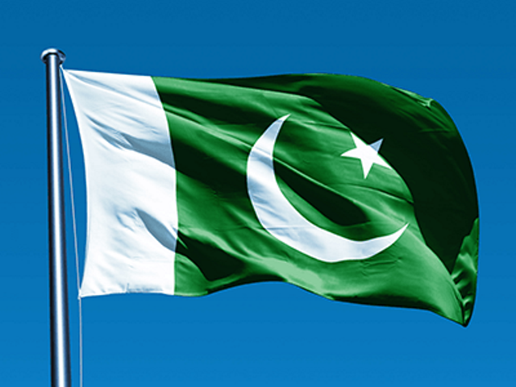  

Pakistan is a country located in South Asia, bordered by India to the east, Afghanistan and Iran to the west, and China to the north. It has a coastline along the Arabian Sea to the south. With a population of over 230 million people, Pakistan is the world's fifth-most populous country. Its capital is Islamabad, while the largest city is Karachi, and Lahore is considered the cultural capital of the country.

## Geography and Natural Beauty  

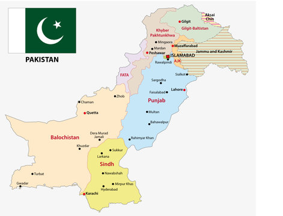

Pakistan is home to a diverse range of geographical features, from the towering peaks of the **Himalayas** and **Karakoram Range** in the north to the vast deserts of **Thar** in the east. The country is also blessed with fertile plains, rich rivers like the **Indus River**, and lush valleys such as **Swat Valley** and **Hunza Valley**.

### Key Natural Landmarks:  

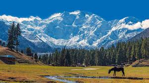  

- **K2**: The second-highest mountain in the world, located in the Karakoram Range.
- **Swat Valley**: Often referred to as the "Switzerland of Pakistan" for its stunning natural beauty.
- **Karimabad**: The main town in Hunza, a popular tourist destination with breathtaking views of the surrounding mountains.

## History

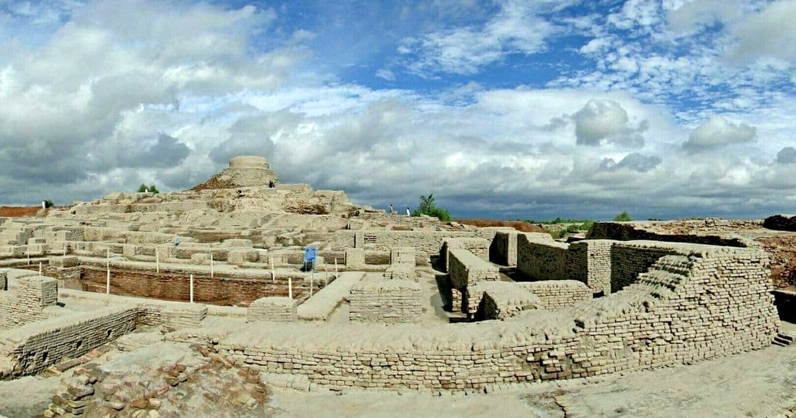  

Pakistan's history dates back to ancient civilizations, including the **Indus Valley Civilization**, one of the world's earliest urban centers, known for its advanced drainage systems and cities like **Mohenjo-Daro** and **Harappa**.

Pakistan was founded on **August 14, 1947**, following the partition of British India, creating a separate state for Muslims. It has had a complex history, shaped by political struggles, military interventions, and efforts for social and economic development.  

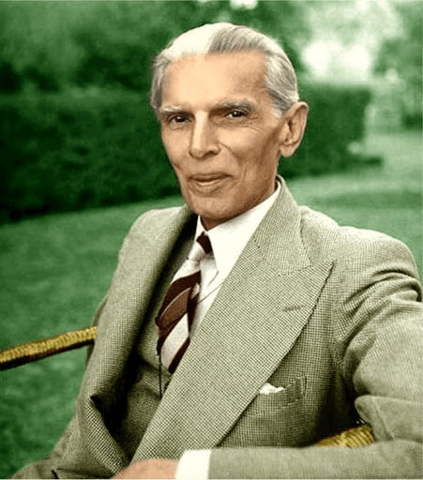  

Pakistan's independence was a result of the tireless efforts of leaders like **Muhammad Ali Jinnah**, who is regarded as the "Father of the Nation."  

## Culture   

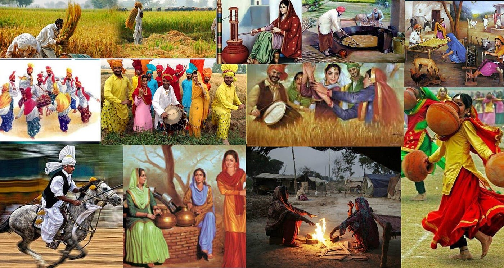  

Pakistan is a culturally rich and diverse country, with various ethnic groups and languages. The country's culture has been shaped by multiple influences, including South Asian, Central Asian, and Persian traditions. The majority of Pakistanis follow **Islam**, and the country celebrates Islamic festivals such as **Eid-ul-Fitr**, **Eid-ul-Adha**, and **Ramadan** with great enthusiasm.

### Popular Aspects of Pakistani Culture:
- **Food**:  
  
 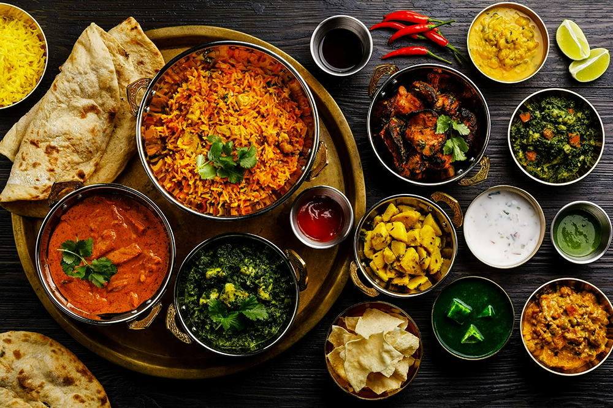  

Pakistan is famous for its flavorful cuisine, including dishes like **Biryani**, **Nihari**, **Chapli Kebab**, and **Saag**. The street food in cities like Lahore and Karachi is also a major part of the food culture.
- **Music**: Traditional music, as well as modern pop and classical music, plays a significant role in Pakistani culture. The country has produced notable musicians, including **Nusrat Fateh Ali Khan** and **Abida Parveen**.  
  
- **Art and Literature**:   

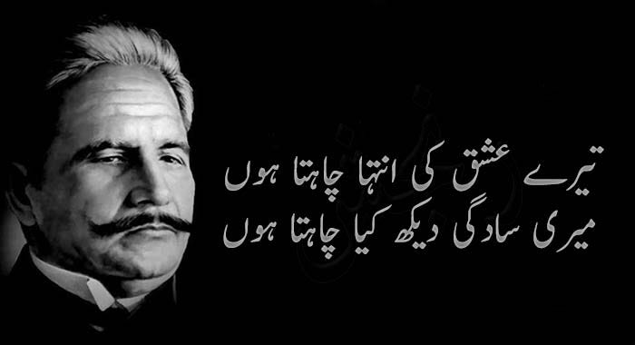  

Pakistan has a rich literary heritage, with poets like **Allama Iqbal** and **Faiz Ahmed Faiz** being iconic figures.   
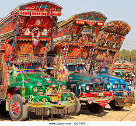   

The country is also known for its vibrant art scene, including **miniature paintings** and **truck art**.

## Key Tourist Destinations  

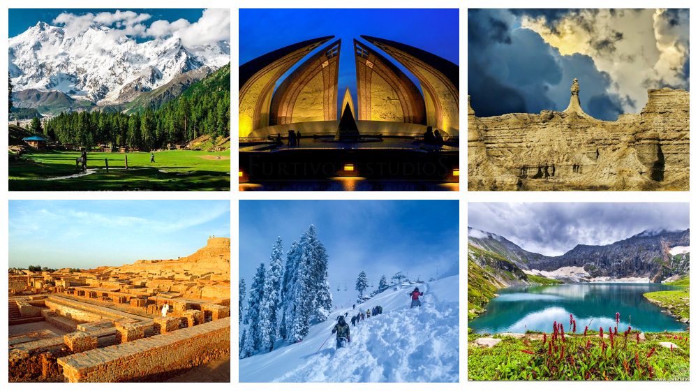

- **Lahore**: Known for its historical landmarks such as the **Badshahi Mosque**, **Lahore Fort**, and the **Shalimar Gardens**.
- **Islamabad**: The capital city, known for its modern architecture, beautiful parks, and landmarks like the **Faisal Mosque** and **Daman-e-Koh**.
- **Karachi**: The financial hub of Pakistan, known for its bustling markets, beaches, and colonial architecture.
- **Murree**: A hill station in the **Punjab** province, popular for its cool weather and scenic views.
- **Skardu**: The gateway to the **Karakoram Range**, famous for its stunning landscapes and trekking routes.

## Language  

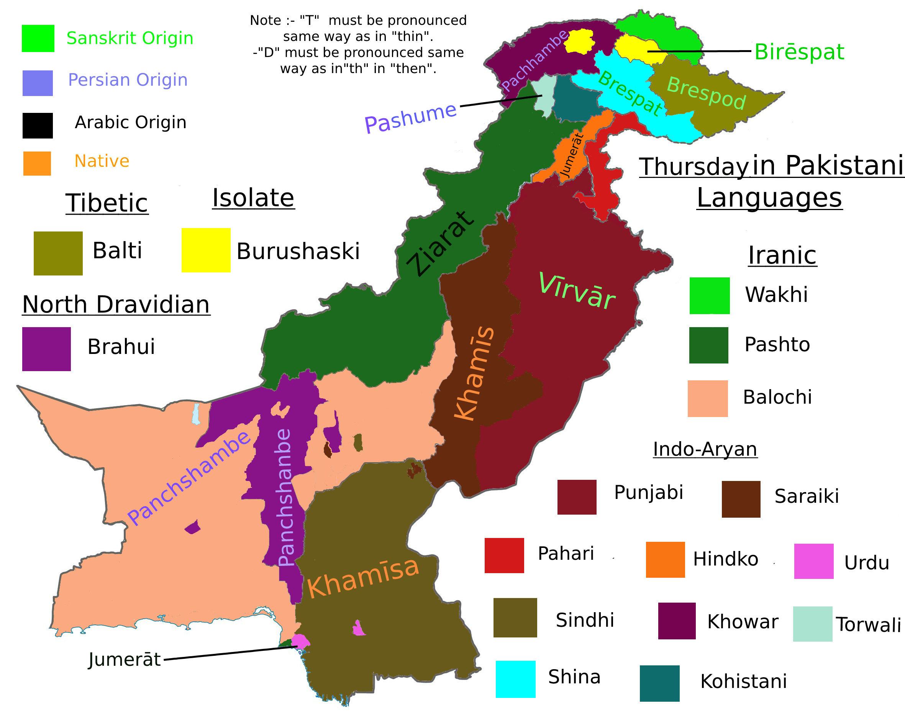

Pakistan's official language is **Urdu**, although **English** is also widely spoken, especially in government, business, and education. The country is home to many regional languages, including **Punjabi**, **Pashto**, **Sindhi**, **Balochi**, and **Saraiki**.

## Conclusion

Pakistan is a land of contrasts—ancient history, diverse cultures, natural wonders, and modern cities. Whether you're exploring its rich past through historical sites, enjoying its beautiful landscapes, or experiencing the vibrant cultural traditions, Pakistan offers something for everyone. The spirit of its people, resilience in the face of challenges, and the beauty of its landscapes make it a unique and fascinating country to explore.

